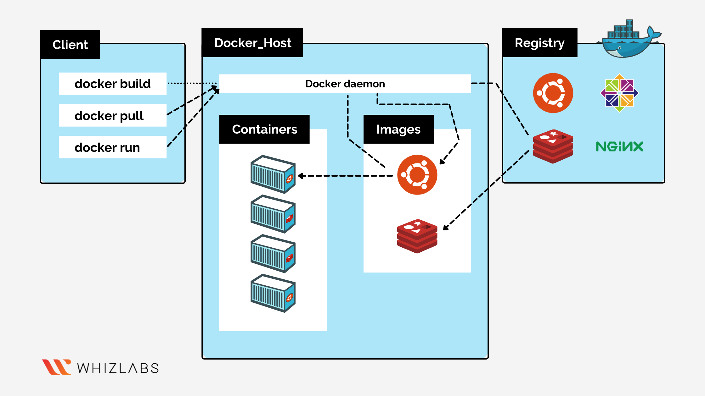

## Understanding containerization and its benefits
What is container? 
* Container is a portable and light weight environment that includes all the dependencies an application requires such as executables, binary code, libraries, and configuration files.
* Container does not contain a full operating system which makes it more light weight. Instead, Docker container shares the same kernel as the host OS.
* Docker Container includes a base image with a user-space operating system but it does not have it's own kernel.  

What is User-space operating system?
* It is a part of an operating system which runs outside the kernel and provide an environment to execute applications.

Benefits of Container
* Portability
* Efficiency
* Faster delivery
* Flexibility

## Overview of Docker and its architecture
What is Docker?
* Docker is a platform as a service which provides users to create, run and maintain applications in a container.
* In simple words it is an application virtualizer
* The container contains the application and the dependencies required to run the application.
* By running an application in a container, it can run on any other device regardless of the operating system, as the container includes all the necessary dependencies and environment required to run the application.
* When a user develops an application and wants to ship it to the testing environment, they don’t need to maintain the exact same setup. Instead, the user can simply ship the container and start testing. Once testing is complete, the same container can be shipped to the production environment, ensuring consistency across different stages.
* Docker can run multiple containers or application at once without conflicts.
* Docker runs on Linux, Windows, and macOS, making it highly portable across different operating systems.

Docker Architecture

* Docker uses a client-server architecture, where docker clients communicates with docker daemon to build, run and manage containers. Docker architecture includes the following key components.
    * Docker Client
    * Docker Daemon
    * Docker Host
    * Docker Registry
* Docker Client
    * It is a Command-Line-Interface which allows user to interact with the docker Daemon through the Docker API to manage containers.
* Docker Daemon
    * The Docker Daemon listens to the Docker API requests and manages the docker objects such as (images,containers,volumes and networks).
* Docker Host
    * It is a physical or virtual machine where the docker engine runs.
* Docker Registry
    * It is a place to store the docker images and can be accessible from anywhere 
